# RxBrain
ai-agent
прототип 
# RxBrain
ai-agent
прототип 
# 🤖 Клинический фармаколог — AI‑агент на базе GigaChat

Агент для поддержки принятия решений в клинической фармакологии. Анализирует медицинские выписки пациентов (PDF), выполняет семантический поиск по структурированной базе инструкций к лекарственным препаратам (18k+ чанков) и формирует персонализированный ответ с учётом возраста, беременности, аллергий и текущей терапии.

##  Ключевые возможности

| Функция | Описание |
|---------|----------|
| **Анализ выписки** | Загрузите PDF – GigaChat извлечёт диагноз, возраст, список лекарств, аллергии, лабораторные показатели |
| **Семантический поиск** | По ключевым словам (МНН, класс препарата, показания) ищет релевантные фрагменты в ChromaDB |
| **Персонализация ответа** | Учитывает возраст, беременность, аллергии, уже принимаемые препараты |
| **Прозрачность** | Возвращает источники (названия препаратов и разделов инструкций) |
| **Структурированный вывод** | JSON с полями `answer`, `sources`, `confidence` |

##  Технологический стек

- **LLM** – GigaChat (Lite / Pro) от Сбера
- **Фреймворк агентов** – LangGraph + LangChain
- **Векторная БД** – ChromaDB
- **Эмбеддинги** – `sentence-transformers/paraphrase-multilingual-MiniLM-L12-v2` (размерность 384)
- **Извлечение текста** – PyPDF2 (опционально)

##  Установка и настройка

### 1. Клонирование репозитория
```bash
git clone https://github.com/your-username/pharma-agent.git
cd pharma-agent
##  труктура 
pharma-agent/
├── config.py                 # конфигурация (пути, модели, API-ключи)
├── embedding_function.py     # класс E5EmbeddingFunction (префиксы passage:/query:)
├── chroma_client.py          # инициализация ChromaDB, загрузка коллекции
├── rag_tools.py              # инструмент search_medical_db (поиск по базе)
├── file_tools.py             # анализ выписки через GigaChat (analyze_document)
├── agent_graph.py            # граф LangGraph: узлы summarize / retrieve / generate
├── run_agent.py              # точка входа – запуск агента с вопросом и файлом
├── check_db.py               # диагностика – проверка количества чанков
└──  requirements.txt          # зависимости
        
## Блок-схема работы агента

```mermaid
flowchart LR
    A[Пользовательский запрос] --> B{Есть файл?}
    B -- Да --> C[analyze_document\nGigaChat]
    C --> D[file_summary\nдиагноз, возраст,\nлекарства, аллергии]
    B -- Нет --> E
    D --> E

    subgraph LangGraph [LangGraph граф]
        direction LR
        E[summarize_query_node] --> F[формирование\nsearch_terms]
        F --> G[retrieve_node]
        G --> H[ChromaDB поиск\nколлекция iqdoc_baseline]
        H --> I[TOP_K=5 чанков]
        I --> J[generate_answer_node]
        J --> K[LLM генерация ответа\nс учётом эпикриза и чанков]
    end

    K --> L[JSON-ответ\nanswer, sources, confidence]
    L --> M[Вывод врачу]
```


